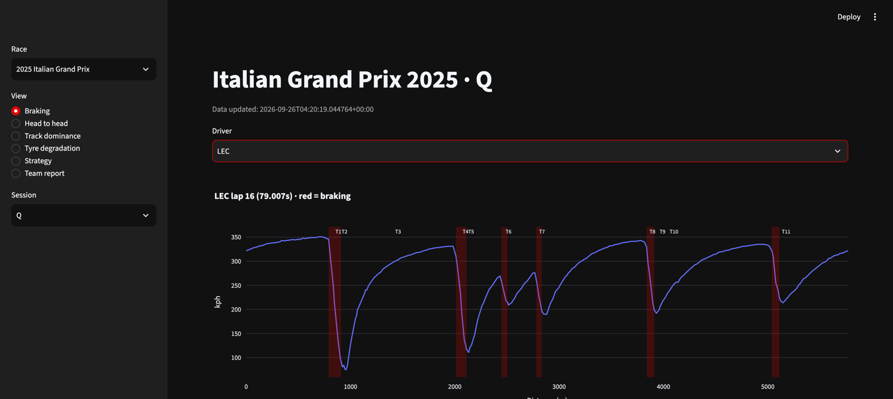
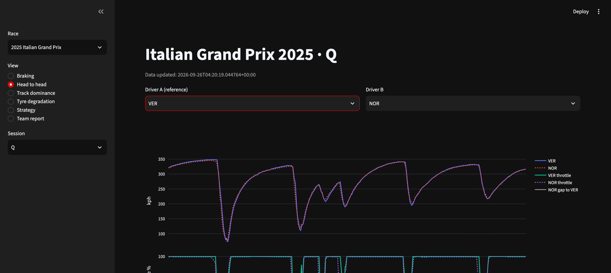
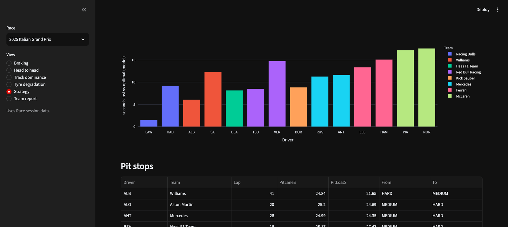

# F1 Intel

Race-by-race Formula 1 telemetry analytics and ML. Where drivers brake, where they lose time, how fast tyres fall off, what the optimal strategy was, and where each team can improve.

Built on [FastF1](https://docs.fastf1.dev) (official F1 timing feed, 2018+), FastAPI, scikit-learn, Plotly and Streamlit.

## Live demo

**[f1-intel.streamlit.app](https://f1-intel.streamlit.app/)**

## Screenshots

| Braking zones | Head to head |
|---|---|
|  |  |

| Track dominance | Strategy simulator |
|---|---|
|  |  |

## Features

| Module | What it answers |
|---|---|
| Braking zones | Where does a driver brake, entry/min/exit speed, avg decel (g), per corner |
| Head to head | Speed/throttle traces, cumulative time delta, corner-by-corner brake point and min-speed diffs |
| Track dominance | Who is fastest in each minisector, drawn on the track map |
| Tyre degradation | Fuel-corrected deg rate (s/lap) per stint and per compound |
| Strategy simulator | Brute-force 1–3 stop plans vs what each driver actually ran, seconds lost vs optimal |
| Team report | Sector gaps, speed-trap deficit, race pace, pit lane time, auto "where to improve" notes |
| Tyre ML model | Gradient-boosted model predicting lap-time loss from tyre age, compound, fuel, temps, circuit, validated leave-circuit-out |
| Race predictor | Positions-gained + DNF models combined via Monte Carlo simulation into P(win)/P(podium)/P(points) per driver; dev/holdout CV'd against grid/quali baselines — [track record and honest results below](#race-outcome-predictor) |
| Qualifying predictor | Positions-gained-vs-rolling-form regressor + Monte Carlo into P(pole)/P(top 3)/P(Q3)/expected position; same trained pipeline works pre-weekend and post-practice (NaN-tolerant FP features) — [results below](#qualifying-predictor) |
| Race predictor v2 | v1 + circuit history (driver/team avg quali/finish at this track, last 3 editions) + rolling quali form; pre-quali, samples its grid from the qualifying model's own simulated distribution instead of one fixed projection — [v2 vs v1 vs grid below](#race-predictor-v2) |

## Quickstart

```bash
python -m venv .venv && source .venv/bin/activate
pip install -r requirements-dev.txt   # dashboard + API + ML training + tests

uvicorn app.main:app --reload                 # API → http://127.0.0.1:8000/docs
streamlit run dashboard/streamlit_app.py      # dashboard
pytest -q                                     # offline tests
python -m scripts.train_tyre_model --year 2025 --max-races 10   # train ML model
```

Only running the dashboard (e.g. for a Streamlit Cloud–style deploy)? `pip install -r requirements.txt` alone is enough — it skips the FastAPI/scikit-learn/pytest deps the dashboard doesn't use at runtime.

First load of any session downloads from F1's feed (30–90 s). After that it's served from `cache/`.

## Deploy your own

1. Fork/push this repo to your own GitHub account.
2. On [share.streamlit.io](https://share.streamlit.io), click "New app" and point it at your repo.
3. Set **Main file path** to `dashboard/streamlit_app.py`, **Branch** to `main`, **Python version** to `3.11`, then deploy. `requirements.txt` (dashboard-only deps) is picked up automatically.

Streamlit Cloud can't reach F1's live timing feed at all, so the dashboard is backed by `data/prebuilt/` — every 2025 race and every completed 2026 race, rebuilt automatically by `.github/workflows/update-data.yml` every Monday and Sunday night (or on demand via workflow_dispatch), which commits and pushes any new data straight to this repo. A race that isn't prebuilt yet falls back to the [OpenF1](https://openf1.org) API, then to a live FastF1 load if you're running locally.

## API

| Method | Path | Example |
|---|---|---|
| GET | `/health` | |
| GET | `/schedule/{year}` | `/schedule/2025` |
| GET | `/{year}/{gp}/drivers?session=R` | `/2025/Monza/drivers` |
| GET | `/{year}/{gp}/braking/{driver}?session=R&lap=fastest` | `/2025/Monza/braking/LEC` |
| GET | `/{year}/{gp}/compare?a=&b=&session=Q` | `/2025/Monza/compare?a=VER&b=NOR` |
| GET | `/{year}/{gp}/dominance?drivers=&session=Q` | `/2025/Monza/dominance?drivers=VER,NOR,LEC` |
| GET | `/{year}/{gp}/degradation` | `/2025/Monza/degradation` |
| GET | `/{year}/{gp}/pits` | `/2025/Monza/pits` |
| GET | `/{year}/{gp}/strategy?max_stops=2` | `/2025/Monza/strategy` |
| GET | `/{year}/{gp}/team-report?session=R` | `/2025/Monza/team-report` |
| POST | `/predict/tyre` | `[{"TyreLife":18,"LapNumber":30,"Compound":"MEDIUM","TrackTemp":42,"Circuit":"Italian Grand Prix"}]` |
| GET | `/predict/race/{year}/{gp}` | `/predict/race/2025/Monza` |

`gp` accepts an event name (`Monza`, `Italian Grand Prix`) or round number (`16`). `session`: `R`, `Q`, `S`, `SQ`, `FP1`–`FP3`.

## Race outcome predictor

Two small `HistGradientBoosting` models, not one direct finish-position regressor (an earlier version of this that predicted finish position directly lost to the grid baseline on every metric — see git history):

- **Positions-gained regressor**: predicts `finish − grid` for classified finishers only. Grid position alone already explains most of the variance in an F1 result, so the model only has to learn the (much smaller, much easier) correction on top of it — and heavy regularization (`max_leaf_nodes=7`, `min_samples_leaf=30`, early stopping) lets it shrink toward "no change" when there's genuinely nothing to add.
- **DNF classifier**: predicts P(DNF) from a small feature set (driver/team rolling DNF rate, grid, circuit type, reg-change flag).
- **Monte Carlo simulation** (10,000 runs per race): each run samples a DNF per driver from P(DNF) (classified at a position resampled from the historical distribution of where retirees actually finished) and, for finishers, `grid + predicted delta + noise`. Noise std is **grid-bucket-dependent** (1–3 / 4–10 / 11+), not one global number — diagnosed on 2022–2024 CV: front-row residual std (~3.7) is meaningfully higher than mid-pack (~3.0), and using one global figure (~3.3) left P(win) under-confident for pole/front-row starters (predicted ~22%, actual ~28%) and over-confident for grid 4–10. **P(win)/P(podium) are then isotonic-calibrated** (fit on 2022–2024 CV predictions, applied unchanged everywhere else) — bucket noise alone only partly closed the gap; isotonic calibration on top closed the rest (dev win Brier 0.0342 → 0.0304 after both fixes). Ranking every simulated run's raw positions and averaging gives P(win)/P(podium)/P(points) per driver, plus an expected position for the predicted running order.

Trained on one row per driver per race (2022–2026, `data/model/race_dataset.parquet`, built by `scripts/build_race_dataset.py`) — grid, qualifying gap to pole, rolling driver/team form, team pace gap, DNF rate, circuit type. Pit-lane starts (`GridPosition == 0` in the raw data) are remapped to the back of the grid (the actual number of cars that started that race) plus a `grid_pit_lane` flag feature — an earlier version of this remap used `max(everyone else's grid) + 1`, which could overshoot the real field size when grid numbers have gaps (confirmed on 2022 round 5: it produced `grid=21` in a 20-car race). Fixing it only touched 2 of 2146 rows and moved the holdout numbers by less than the width of their own confidence intervals below — see `tests/test_build_race_dataset.py`.

**Evaluation protocol**: every design decision (features, model architecture, hyperparameters, the grid-bucket noise scheme, the isotonic calibrators) was chosen/fit using expanding-window walk-forward CV on 2022–2024 ("dev") only — `select_hyperparams()`/`select_dnf_hyperparams()` raise immediately if ever handed a 2025+ row, so this is enforced in code, not just convention (`tests/test_race_predictor.py::test_select_hyperparams_refuses_holdout_rows`). 2025–2026 ("holdout") was then evaluated exactly once and is reported below as-is.

**Holdout result (2025–2026, 38 races, 787 driver-rows)**, model vs **finish = grid** vs **finish = qualifying position**:

| metric | model | grid | quali |
|---|---|---|---|
| position MAE (↓) | **3.30** | 3.37 | 3.32 |
| Spearman (↑) | 0.66 | 0.65 | **0.66** |
| top-3 hit rate | **0.87** | 0.82 | 0.82 |
| winner accuracy | 0.55 | **0.66** | **0.66** |
| points F1 | 0.77 | 0.77 | **0.78** |

Probabilistic (Brier / log loss, lower is better) vs a baseline that turns grid position into a probability (empirical P(outcome \| grid slot) from 2022–2024 only):

| outcome | model Brier | baseline Brier | model log loss | baseline log loss |
|---|---|---|---|---|
| win | 0.0283 | **0.0261** | 0.090 | **0.101** |
| podium | 0.0633 | **0.0610** | **0.212** | 0.203 |
| points | **0.1618** | 0.1626 | **0.497** | 0.500 |

**How strong is that claim, really?** Bootstrap 95% CIs (2,000 resamples of whole holdout races, not rows — see `bootstrap_diff_ci()`) on model-minus-baseline, **after** the grid-bucket-noise + isotonic-calibration fix:

| difference (model − baseline) | mean | 95% CI | significant? |
|---|---|---|---|
| position MAE vs grid | −0.066 | [−0.187, +0.044] | no — CI includes 0 |
| points Brier vs grid-probability | −0.0008 | [−0.0073, +0.0054] | no — CI includes 0 |
| win Brier vs grid-probability | +0.0023 | [−0.0012, +0.0059] | no — CI includes 0 |

Before the fix, win Brier's CI was [+0.0016, +0.0095] — a statistically real deficit (the model was reliably *worse* than the baseline at win-probability calibration). After grid-bucket noise + isotonic calibration (both fit on 2022–2024 CV only), that CI now straddles zero: **the deficit is gone**, and none of the three differences are statistically distinguishable from noise at this sample size (38 races).

**Honest result: still doesn't clearly win, but the one real weakness found in the previous round is fixed.** Point estimates lean the model's way on position MAE and top-3 hit rate, the baselines' way on winner accuracy and podium log loss — none of it is significant either direction. **Closest**: points classification, essentially indistinguishable from the baseline on every metric. **Furthest behind (though no longer *significantly* behind)**: still winner accuracy — with ~2,100 training rows, there isn't enough signal to reliably beat grid position at predicting *who wins*, only at approximately matching it. See `app/models/race_predictor.py`'s module docstring, the dashboard's "Race predictor" view (calibration chart + season track record), or `models/race_predictor_metrics.json` (regenerated by `scripts.train`-style calls, gitignored) for the full dev+holdout+per-season breakdown.

**The model is now frozen** (v1.0.0, frozen 2026-09-28, `data/model/frozen/`) — no further tuning after this point. `scripts/predict_next_race.py` and everything else (`ensure_trained()`, so the API route and dashboard too) load this exact committed snapshot from here on, never a freshly self-trained copy, so the numbers above can't silently drift underneath a later code change. Re-freezing (`scripts/freeze_race_predictor.py`) is a deliberate, manual, rare action — bump the version and note why. Freeze with the same Python environment `requirements.txt` pins (a joblib file pickled by one scikit-learn version can fail to load in another — confirmed live going from local sklearn 1.4.2 to the pinned 1.9.1).

### Live track record since 2026-09-28

The clean, ongoing, genuinely prospective test: `predictions/{year}.csv` rows logged **at or after the freeze date**, scored against real results, completely untouched by any further tuning (unlike the CV/holdout numbers above, which did inform earlier design decisions). See the dashboard's "Race predictor" view for the live, always-current version of this section — as of this freeze, no race has been predicted since 2026-09-28 yet, so there's nothing to report here yet either. It fills in automatically as the weekly GitHub Action (Saturday predict, Monday score) runs going forward.

Weekly predictions are logged automatically: `scripts/predict_next_race.py` runs after qualifying (Saturday 20:00 UTC) and appends predicted position + P(win)/P(podium)/P(points) per driver to `predictions/{year}.csv`; `scripts/score_predictions.py` runs after the race (Monday) and fills in actual results. Both fail loudly (non-zero exit) if expected data is missing rather than silently doing nothing.

## Qualifying predictor

A `HistGradientBoostingRegressor` predicting `target_quali_delta = quali_position − driver_rolling_quali_position_3` (same positions-gained-vs-form framing as the race predictor), Monte Carlo simulated into P(pole)/P(top 3)/P(Q3) and an expected position. "Pre-weekend" and "post-practice" aren't two models — `fp_best_gap_s`/`fp_long_run_gap_s` (best/long-run FP2–FP3 pace gap to the fastest car) are NaN before practice happens and populated after; `HistGradientBoosting` handles missing values natively, so the one trained pipeline quietly improves once those columns fill in. Features also include circuit quali history (driver/team avg + last-year quali position here, last 3 editions), rolling quali form (last 3/5), and the teammate quali-gap trend. Baselines: rolling quali position (last 5), and the single most recent prior edition's quali position at this circuit ("last year here").

**Holdout (2025–2026, 38 races, 781 driver-rows)**:

| metric | model | rolling-5 baseline | last-year-here baseline |
|---|---|---|---|
| position MAE (↓) | **3.11** | 3.15 | 4.62 |
| Spearman (↑) | 0.747 | 0.746 | 0.498 |
| top-3 hit rate | **0.76** | 0.68 | 0.55 |
| pole accuracy | 0.21 | **0.26** | 0.16 |

Probabilistic (Brier, lower is better) vs the rolling-position-bucket baseline (empirical P(outcome \| rolling bucket), fit on 2022–2024 only):

| outcome | model Brier | baseline Brier |
|---|---|---|
| pole | **0.0406** | 0.0427 |
| top 3 | **0.0784** | 0.0812 |
| Q3 | **0.1338** | 0.1414 |

**Bootstrap 95% CIs** (2,000 resamples of whole holdout races):

| difference (model − baseline) | mean | 95% CI | significant? |
|---|---|---|---|
| position MAE vs rolling-5 | −0.047 | [−0.177, +0.079] | no — CI includes 0 |
| pole Brier vs rolling-bucket baseline | −0.0020 | [−0.0056, +0.0015] | no — CI includes 0 |

**Top features** (permutation importance, MAE increase when shuffled): `driver_rolling_quali_position_3` (0.76), `driver_rolling_quali_position_5` (0.28), `team_circuit_last_quali` (0.17), `fp_best_gap_s` (0.08), `teammate_quali_gap_trend_3` (0.05), `driver_circuit_avg_quali_3` (0.05).

**Honest result**: clearly beats the weak last-year-here baseline, but is statistically indistinguishable from the simple rolling-5-position baseline on both position MAE and pole-probability calibration — same story as the race predictor. The model does lean its way on point estimates (MAE, top-3 hit rate, both Brier scores) while the baseline wins on pole accuracy specifically, but none of it clears the 38-race sample's noise floor. **Frozen as quali v1.0.0** (`data/model/frozen/quali_model.joblib` + `quali_spec.json`, frozen 2026-10-01) — `app/models/quali_predictor.py::ensure_trained()` loads this exact snapshot everywhere (dashboard, `scripts/predict_staged.py`), never a freshly self-trained copy.

## Race predictor v2

v1's exact features plus circuit history (driver/team avg quali position + avg finish at this circuit over the last 3 prior editions, races-raced-here count, a `circuit_new_or_changed` flag for brand-new or materially-relaid venues) and driver/team rolling quali form. The one new mechanic: **before qualifying, each of the 10,000 Monte Carlo runs samples its own grid from the qualifying model's simulated rank distribution** (`simulate_quali_positions(..., return_ranks=True)`) instead of collapsing qualifying uncertainty to one fixed projected grid first — so a driver who's simulated on pole in some runs and P8 in others carries that spread into the race simulation itself. v1 (`data/model/frozen/model.joblib`) stays frozen and running, completely untouched; v2 is a separate, additional model.

**Holdout (2025–2026, 38 races, 787 driver-rows)**, v2 vs the **grid baseline**:

| metric | v2 | grid |
|---|---|---|
| position MAE (↓) | 3.347 | **3.366** |
| Spearman (↑) | **0.665** | 0.651 |
| top-3 hit rate | **0.842** | 0.816 |
| winner accuracy | 0.526 | **0.658** |
| points F1 | **0.771** | 0.768 |

Probabilistic (Brier, lower is better) vs a baseline that turns grid position into a probability (empirical P(outcome \| grid slot), fit on 2022–2024 only):

| outcome | v2 Brier | grid-probability baseline Brier |
|---|---|---|
| win | 0.0305 | **0.0261** |
| podium | 0.0649 | **0.0610** |
| points | 0.1622 | **0.1626** (tie) |

**Bootstrap 95% CIs vs the grid baseline** (2,000 resamples of whole holdout races):

| difference (v2 − grid) | mean | 95% CI | significant? |
|---|---|---|---|
| position MAE | −0.018 | [−0.136, +0.102] | no — CI includes 0 |
| points Brier | −0.0004 | [−0.007, +0.006] | no — CI includes 0 |
| win Brier | **+0.0045** | **[+0.0007, +0.0085]** | **yes — v2 is worse** |

**v2 vs v1** (paired bootstrap on the identical 38 holdout races, re-running v1's own private walk-forward/calibration code on the same dataset — not touching v1's frozen artifact):

| difference (v2 − v1) | mean | 95% CI | significant? |
|---|---|---|---|
| position MAE | +0.047 | [−0.028, +0.116] | no — CI includes 0 |
| win Brier | +0.0023 | [−0.0003, +0.0050] | no — CI includes 0 (borderline) |

**Top features** (permutation importance on the positions-gained model, MAE increase when shuffled): `grid` (2.04), `team_rolling_avg_finish_3` (0.27), `driver_rolling_avg_finish_5` (0.23), `team_circuit_avg_finish_3` (0.05), `quali_gap_to_pole_s` (0.04), `quali_position` (0.04), `driver_circuit_avg_quali_3` (0.03). Circuit history ranks well below grid and rolling race-finish form — it's a real but minor signal here, not the headline feature the dataset work invested in.

**Honest result: circuit history doesn't move the needle, and v2 is a step sideways at best.** v2 vs v1 is not significantly different either direction. v2 vs the grid baseline is a *significant* loss on win-Brier calibration specifically (CI entirely above 0) — the same win-calibration fragility v1 had before its grid-bucket-noise + isotonic-calibration fix, now reappearing in v2 despite using the identical fix, likely because circuit history and the quali-sampled grid add enough extra variance to the win-probability tail that the isotonic calibrator (fit on 2022–2024 dev data) under-corrects it on 2025–2026. Every other metric is statistically a wash. **Frozen as race v2.0.0** (`data/model/frozen/race_v2_model.joblib` + `race_v2_spec.json`, frozen 2026-10-01).

### Live track record by stage

`scripts/predict_staged.py` logs quali + race v2 predictions to `predictions/{year}_quali_{stage}.csv` / `predictions/{year}_race_v2_{stage}.csv` at three points in a race weekend — `forecast` (Monday, before FP1), `post_practice` (Saturday, after FP3), `post_quali` (Saturday, after qualifying) — and `scripts/score_staged.py` fills in actual results once they're in. v1 keeps logging to its own unchanged `predictions/{year}.csv` via `predict_next_race.py`. The dashboard's Predictions view has a "Live track record by stage" panel scoring each stage independently (quali model vs its two baselines; race v2 vs the grid baseline and vs v1, paired on the same races) from predictions logged at or after each model's own freeze date — genuinely prospective, not CV re-examined. As of this freeze (2026-10-01), no stage has a scored race yet; it fills in automatically as the new Monday/Saturday-16:00/Saturday-20:00 UTC crons run going forward.

## Method notes and limits

- **Brake data is on/off, not pressure**, and car data is ~3.7 Hz. Brake points are accurate to roughly one sample (~20 m at speed).
- **Fuel correction** adds `0.035 s × (lap − 1)` (configurable in `app/config.py`), a public rule-of-thumb estimate.
- **Strategy model** assumes new tyres each stint and a linear deg curve per compound, fitted field-wide on green-flag laps relative to each driver's median (removes car pace). It ignores traffic, safety cars and tyre cliffs; treat totals as relative, not absolute.
- **Team report** compares public timing only. Real teams have far richer data; this finds visible symptoms, not root causes.

## Project structure

```
app/
  main.py              FastAPI routes
  config.py            constants (fuel effect, pit loss, thresholds)
  data.py              session loading, caching, lap/telemetry helpers, JSON serialisation
  analysis/            braking.py, delta.py, pits.py, team_report.py
  models/              degradation.py, strategy.py, tyre_ml.py, race_predictor.py, quali_predictor.py, race_predictor_v2.py
dashboard/streamlit_app.py
scripts/train_tyre_model.py
scripts/smoke_test.py   exercises every route's functions against a real session
scripts/build_prebuilt.py   builds data/prebuilt/ (run locally or by the update-data Action); FP1-3 are laps-only
scripts/build_race_dataset.py   builds data/model/race_dataset.parquet (run locally, not by any Action)
scripts/freeze_race_predictor.py   trains + commits data/model/frozen/ (run locally, manually, rarely)
scripts/freeze_quali_predictor.py   same, for the qualifying model
scripts/freeze_race_predictor_v2.py   same, for race predictor v2
scripts/predict_next_race.py   logs a prediction row per driver to predictions/{year}.csv (Action: Saturday 20:00 UTC) using ONLY the frozen v1 model
scripts/predict_staged.py   logs staged quali/race-v2 predictions (forecast/post_practice/post_quali) to predictions/{year}_{model}_{stage}.csv
scripts/score_predictions.py   fills in actual results for v1 once a race is over (Action: Monday)
scripts/score_staged.py   fills in actual results for the staged quali/race-v2 files
tests/                 offline tests on synthetic data
data/processed/{year}/{round}.parquet   Parquet cache for live-loaded races (gitignored)
data/prebuilt/{year}/{round}/{session}/   committed prebuilt bundle: laps/results/corners/telemetry parquet + manifest.json
data/model/race_dataset.parquet   committed race-predictor training set, one row per driver per race
data/model/frozen/   committed frozen snapshots: v1 (model.joblib), quali (quali_model.joblib), v2 (race_v2_model.joblib) + each one's spec.json (version, frozen_at, hyperparams)
predictions/{year}.csv   committed public track record of v1's weekly predictions vs actual results
predictions/{year}_quali_{stage}.csv, predictions/{year}_race_v2_{stage}.csv   same, per stage, for the quali and race v2 models
.github/workflows/update-data.yml   rebuilds data/prebuilt/ on its own cron; scores/predicts races (v1 + staged) on theirs
docs/img/              README screenshots
```

## Data

FastF1 pulls from F1's live timing service. This project is unofficial and not associated with Formula 1.

The dashboard reads from three sources, in order: the **prebuilt bundle** (`data/prebuilt/`, committed to the repo and refreshed automatically — see Deploy above), the **[OpenF1](https://openf1.org) API** for a race that isn't prebuilt yet, and finally a **live FastF1 load** (only reachable when running locally; Streamlit Cloud can't reach F1's timing service). If none of the three have the session yet, the dashboard says so and suggests trying again later. Race laps loaded live are also cached to `data/processed/{year}/{round}.parquet` so a second local request skips FastF1.
